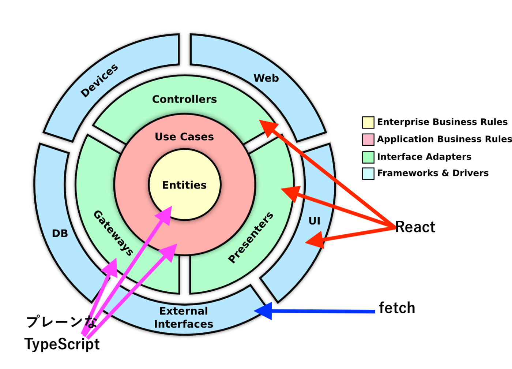

# Web アプリ

CleanArchitecture の構成に寄せています。特に意識している点は下記の通りです。

- domain について

  - ライブラリの依存を控える
  - class ベースでは無く関数で流れを表すようにする

- データの永続化や取得

  - domain の repository と、gateway で抽象化する

- `catch` どこで必要か？

  - 一番外側のレイヤーでする。内側のレイヤーでは`catch`を不要にする

- `repository`はどこでもらうか？

  - controller でもらう

- 動作環境
  - **非**SSR での使用を想定

## 依存関係と責務

### 全体像


### pages/


## データの流れと TypeGuard

データは、class にいれて受け渡します。ただの箱として扱い、出し入れ用のメソッドしかありません。

```ts
GatewayData.of({ id: 123, name: `tommy`, type: human });
```

利点は、TypeGuard を利用して正常系か、例外系かのデータが判断しやすいためです。

```ts
if (obj instanceof GatewayData) {
  // 正常系データ
}
```

`isErr`などを付与せずに済ます。

```ts
const obj = { isErr: false, id: 123, name: `tommy`, type: human };
if (!obj.isErr) {
  // 正常系データ
}
```

## 用語の整理

- Domain の WorkFlow  
  処理の流れを書いています。UseCase から使用されます  
  Domain に対しての API です

- Domain の Repository  
  Domain からみて扱いやすいデータの集合です。CRUD に準拠するメソッドがはえています。実装はありません。
  保存先や取得先の隠蔽する事が目的です  
  オンメモリのような感じで扱える事を目的としています  
  粒度は、整合性の単位です。(DB で言う所の、トランザクション相当)

- gateway  
  Domain の Repository 向けの実装です。外界から入ってきたデータをこちらの世界にいれる際の中継役です

- Entity  
  id が同一であれば、同じとみなす object です。

- ValueObject  
  deepEqual で同じなら、同じとみなす object です。

## State

### State の種類

- ui  
  トグルの開閉、モーダルの切り替え

- app  
  ローディング中  
  ログイン者

- domain  
  domain 特有のステート  
  ユーザ情報や、商品情報

- operations  
  `state`操作する際に、`dispatch`を実行するがそれの隠蔽。  
  複数の dispatch を束ねても良い

- selectors  
  計算が必要な値`is` `has` `can` のような prefix がつく  
  domain の state に応じて生成される場合が多い

## 画面表示までの流れ


## 役割



## コードの重複度合い

- https://yy-jscpd.netlify.app/jscpd/jscpd-report

[](https://app.netlify.com/sites/yy-jscpd/deploys)
