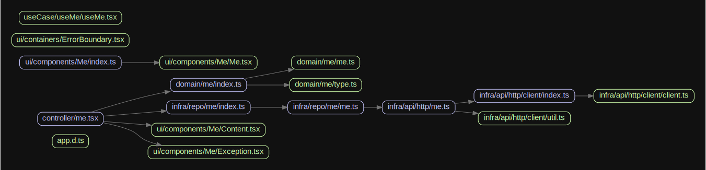

# React アプリ

- 正常系, 想定内のエラー(Exception), 想定外のエラー(Error)を考慮しています。
- src/配下のディレクトリをレイヤーとみなし、データの受け渡しを厳格にしています。

---

### pages/

- Next.js の`pages`です。
- src/pages/でも OK だが、単体テスト対象外なので、page/に配置しています。
- SSR しない想定で実装しています。
- src/ui/へ`props`の提供をします。

---

### src/ui/

#### components/

- Stateless Component の置き場です。
- 正常系の Component, 例外系 Component, 取得中の Component を準備しています。

```bash
  components
└──   Me
   ├──   Content.tsx # 正常系
   ├──   Exception.tsx # 例外系
   ├──   index.ts # 利用して欲しいComponentのみ`export`
   └──   Me.tsx # 取得中
```

#### containers/

- ui に関わるが、特殊な TSX を配置しています。例えば Error ハンドリング用の Component です。

---

### src/controller/

- pages/から`import`され Component 生成処理を提供します。
- ui の初期値などはここで、取得します。
- 処理の内容は、src/domain/の workFlow に記載しています。domain を API として利用しています。

---

### src/useCase/

- hooks を提供します。

---

### src/domain/

- class ベースではなく、関数ベースで実装いています。処理の流れを意識しています。
- `type WorkFlow`は、`query`や`write`をトップレベルのキーとして持ちます。
- repository をもらい、repository 用のパラメタをもらい、実行結果を返す。ような流れの型です。

---

### src/infra/

#### repo/

- src/domain/の`type Repository`の実装です。

#### api/

- src/infra/repo/からよばれます。

---

### src/shared/

- 全レイヤーで使用する処理を置いています。

## データの流れと TypeGuard

データは、class にいれて受け渡します。ただの箱として扱い、出し入れ用のメソッドしかありません。

```ts
InfraData.of({ id: 123, name: `tommy`, type: human });
```

```ts
class InfraData<T> {
  private constructor(private _value: T) {}

  get value(): T {
    return { ...this._value };
  }

  static of<V>(v: V): InfraData<V> {
    return new InfraData(v);
  }
}
```

利点は、TypeGuard を利用して正常系か、例外系かのデータが判断しやすいためです。

```ts
const obj = { isErr: false, data: "ok" };
if (!obj.isErr) {
  // 正常系データ
}
```

`isErr`などを付与せずに済ます。

```ts
const obj = InfraData.of({ data: "ok" });
if (obj instanceof InfraData) {
  // 正常系データ
}
```

## 用語の整理

- Domain の WorkFlow  
  useCase や controller から、import されます。処理の流れを書いています。

- Domain の Repository  
  Domain からみて扱いやすいデータの集合です。CRUD に準拠するメソッドがはえています。実装はありません。実装は Infra にまかせます。  
  保存先や取得先の隠蔽がメリットです。  
  オンメモリのような感じで扱える事を目的としています。  
  粒度は、整合性の単位です。(DB で言う所の、トランザクション相当)

- Infra の Repository  
  Domain の Repository 向けの実装です。しかしここに処理を書くよりは、更に先に書いてそれを利用します。

- Entity  
  id が同一であれば、同じとみなす object です。

- ValueObject  
  deepEqual で同じなら、同じとみなす object です。

## state の種類

- ui  
  トグルの開閉、モーダルの切り替え

- app  
  ローディング中  
  ログイン者

- domain  
  domain 特有のステート  
  ユーザ情報や、商品情報

- operations  
  `state`操作する際に、`dispatch`を実行するがそれの隠蔽。  
  複数の dispatch を束ねても良い

- selectors  
  計算が必要な値`is` `has` `can` のような prefix がつく  
  domain の state に応じて生成される場合が多い

## 全体像


