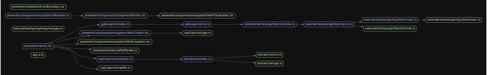
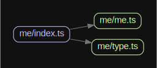
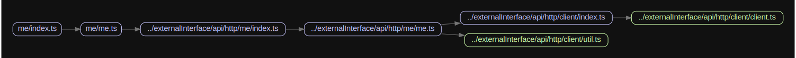
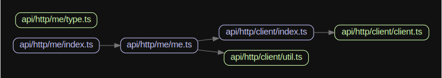

# React アプリ

## 概要

CleanArchitecture の構成に寄せています。特に意識している点は下記の通りです。

### domain について

- ライブラリの依存を控える
- class ベースでは無く関数で流れを表すようにする

### データの永続化や取得

- domain の repository や、gateway で抽象化する

### データの種類について

- どこで作られたデータかをわかりやすくする
- 正常系, 想定内のエラー(Exception), 想定外のエラー(Error)を考慮する

### ディレクトリ構成

- 非 SSR での動作を想定しています



### pages/

- Next.js の`pages`です
- SSR しない想定で実装しています
- CleanArchitecture で言う所の、UI や Web


---

### src/presenter/

- React の Component
- domain コンポーネントと、useCase のカスタムフックスが 1:1


#### components/

- StatelessComponent にしています
- 正常系の Component, 例外系 Component, API からデータ取得中の Component を準備しています

#### containers/

- 特殊な Component や TSX を配置しています。例えば Error ハンドリング用の Component です

---

### src/useCase/

- CustomHooks 置き場


---

### src/domain/

- class ベースではなく、関数ベースで実装いています。処理の流れを意識しています
- repository とパラメタをもらい、実行結果を返す。ような流れです



---

#### src/gateway/

- src/domain/の`type Repository`の実装です



#### src/externalInterface/

- src/gateway/からよばれます。

## 

### src/shared/

- 全レイヤーで使用する処理を置いています。

## データの流れと TypeGuard

データは、class にいれて受け渡します。ただの箱として扱い、出し入れ用のメソッドしかありません。

```ts
GatewayData.of({ id: 123, name: `tommy`, type: human });
```

利点は、TypeGuard を利用して正常系か、例外系かのデータが判断しやすいためです。

```ts
if (obj instanceof GatewayData) {
  // 正常系データ
}
```

`isErr`などを付与せずに済ます。

```ts
const obj = { isErr: false, id: 123, name: `tommy`, type: human };
if (!obj.isErr) {
  // 正常系データ
}
```

## 用語の整理

- Domain の WorkFlow  
  処理の流れを書いています。UseCase から使用されます  
  Domain に対しての API です

- Domain の Repository  
  Domain からみて扱いやすいデータの集合です。CRUD に準拠するメソッドがはえています。実装はありません。
  保存先や取得先の隠蔽する事が目的です  
  オンメモリのような感じで扱える事を目的としています  
  粒度は、整合性の単位です。(DB で言う所の、トランザクション相当)

- gateway  
  Domain の Repository 向けの実装です。外界から入ってきたデータをこちらの世界にいれる際の中継役です

- Entity  
  id が同一であれば、同じとみなす object です。

- ValueObject  
  deepEqual で同じなら、同じとみなす object です。

## State

### State の種類

- ui  
  トグルの開閉、モーダルの切り替え

- app  
  ローディング中  
  ログイン者

- domain  
  domain 特有のステート  
  ユーザ情報や、商品情報

- operations  
  `state`操作する際に、`dispatch`を実行するがそれの隠蔽。  
  複数の dispatch を束ねても良い

- selectors  
  計算が必要な値`is` `has` `can` のような prefix がつく  
  domain の state に応じて生成される場合が多い

## 画面表示までの流れ


