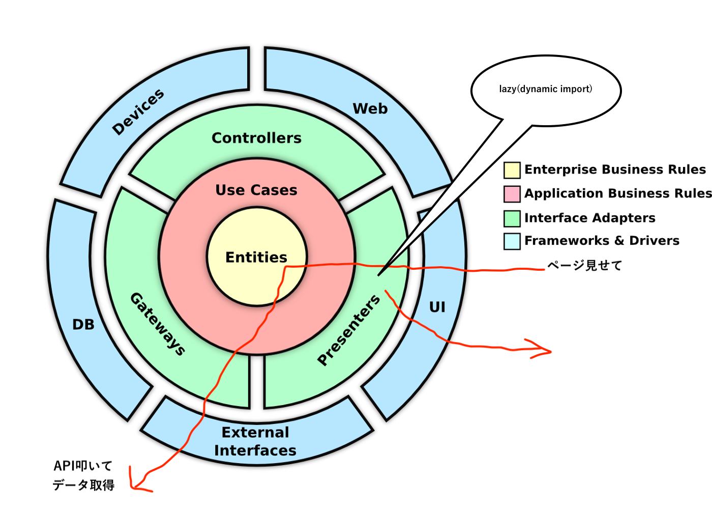
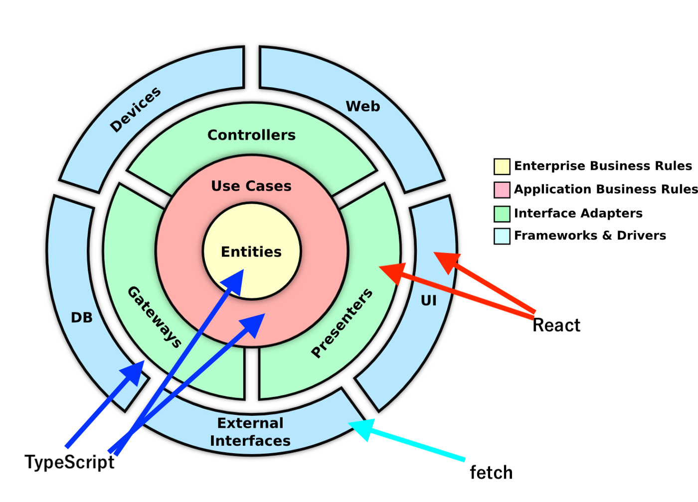

# Web アプリ

## 概要

CleanArchitecture の構成に寄せています。特に意識している点は下記の通りです。

### domain について

- ライブラリの依存を控える
- class ベースでは無く関数で流れを表すようにする

### データの永続化や取得

- domain の repository と、gateway で抽象化する

### 動作環境

- **非**SSR での使用を想定

---

### pages/

- Next.js の`pages`です
- CleanArchitecture で言う所の UI です。しかしアプリの特性上 presenter も兼ねています


---

### src/controller/

- Component の選択や初期値の準備をします


### src/presenter/

- components
  - StatelessComponent です
  - 正常系の Component, 例外系 Component, SuspenseComponent をじゅんびしています
- containers
  - 特殊な Component や TSX を配置しています。例えば Error ハンドリング用の Component です
- hooks
  - hooks を配置しています


#### src/gateway/

- src/domain/の`type Repository`の実装
- 外部に通信する際の中継役


---

### src/useCase/

- domain と app の中継役


---

### src/domain/

- class ベースではなく、関数ベースで実装いています。処理の流れを意識しています
- repository とパラメタをもらい、実行結果を返す。ような流れです


---

#### src/externalInterface/

- src/gateway/からよばれます


### src/shared/

- 全レイヤーで使用する処理を置いています。

### 全体像


---

## データの流れと TypeGuard

データは、class にいれて受け渡します。ただの箱として扱い、出し入れ用のメソッドしかありません。

```ts
GatewayData.of({ id: 123, name: `tommy`, type: human });
```

利点は、TypeGuard を利用して正常系か、例外系かのデータが判断しやすいためです。

```ts
if (obj instanceof GatewayData) {
  // 正常系データ
}
```

`isErr`などを付与せずに済ます。

```ts
const obj = { isErr: false, id: 123, name: `tommy`, type: human };
if (!obj.isErr) {
  // 正常系データ
}
```

## 用語の整理

- Domain の WorkFlow  
  処理の流れを書いています。UseCase から使用されます  
  Domain に対しての API です

- Domain の Repository  
  Domain からみて扱いやすいデータの集合です。CRUD に準拠するメソッドがはえています。実装はありません。
  保存先や取得先の隠蔽する事が目的です  
  オンメモリのような感じで扱える事を目的としています  
  粒度は、整合性の単位です。(DB で言う所の、トランザクション相当)

- gateway  
  Domain の Repository 向けの実装です。外界から入ってきたデータをこちらの世界にいれる際の中継役です

- Entity  
  id が同一であれば、同じとみなす object です。

- ValueObject  
  deepEqual で同じなら、同じとみなす object です。

## State

### State の種類

- ui  
  トグルの開閉、モーダルの切り替え

- app  
  ローディング中  
  ログイン者

- domain  
  domain 特有のステート  
  ユーザ情報や、商品情報

- operations  
  `state`操作する際に、`dispatch`を実行するがそれの隠蔽。  
  複数の dispatch を束ねても良い

- selectors  
  計算が必要な値`is` `has` `can` のような prefix がつく  
  domain の state に応じて生成される場合が多い

## 画面表示までの流れ



## 役割



## 方針など

- `catch` どこで必要か？

  - 一番外側のレイヤーでする

- `repository`はどこでもらうか？
  - app/controller でもらう

## コードの重複度合い

- https://yy-jscpd.netlify.app/jscpd/jscpd-report

[](https://app.netlify.com/sites/yy-jscpd/deploys)
